# Predicting Commercial Carrier Safety Violations at National Scale

A machine learning analysis of US federal trucking safety data —
predicting Out-of-Service violations and segmenting carrier risk across
~2 million commercial carriers.

**Tools:** R · Random Forest (ranger) · K-Means Clustering · tidyverse  
**Data:** Public US FMCSA Safety Measurement System — 90M+ raw rows  
**Type:** End-to-end pipeline (data engineering → modeling → segmentation)

---

## The Business Problem

The US Federal Motor Carrier Safety Administration oversees roughly 2 
million trucking carriers but can only inspect a fraction each year. 
Spreading inspections evenly wastes enforcement resources on low-risk 
operators while high-risk ones slip through.

**The question:** Can we predict which carriers are likely to fail a 
safety inspection — so resources get targeted at the highest-risk 
operators?

---

## Key Finding — Behavior Beats Identity

Two Random Forest models were compared to isolate what actually predicts 
risk:

| Model | AUC | Features Used |
|---|---|---|
| Baseline | 0.62 | Static profile only (fleet size, location, crash history) |
| Behavioral | **0.91** | + Inspection history, violation rates |

The 0.62 → 0.91 jump quantifies a concrete insight: **how a carrier 
behaves over time predicts risk far better than its static profile.**

The strongest single predictor was **vehicle maintenance violation rate** 
— mechanical neglect, not driver conduct, is the clearest warning sign.

---

## Risk Segmentation

K-Means clustering on 15 standardized features segmented the carrier 
population into four distinct risk profiles.

One segment stood out: **Cluster 4 — large interstate fleet operators** 
— responsible for peak crash frequency and the highest aggregate severity 
weight, warranting disproportionate enforcement focus. A separate hazmat 
cluster showed elevated hazmat violation rates despite lower overall crash 
frequency, requiring specialized rather than general intervention.
---

## Analytical Rigor

- Stratified train/test split to preserve class balance
- Geographic risk tiers learned from training data only — no leakage
- Class weighting to handle imbalanced outcomes
- Cross-validated hyperparameter tuning
- Leakage-free baseline (AUC 0.62) reported as conservative reference

---

## Business Implication

A regulator could use this framework to score every carrier's risk 
probability, prioritize the highest tiers for inspection, and tailor 
enforcement tactics by segment — shifting from reactive post-crash 
investigation toward predictive pre-crash prioritization.

---

## What This Demonstrates

- Handling large-scale messy real-world data (90M+ rows across 4 
  joined federal datasets)
- Feature engineering for behavioral risk signals
- Honest model evaluation including documented limitations
- Translating statistical findings into operational recommendations

---

## Visualizations

### EDA — Data Quality & Distributions
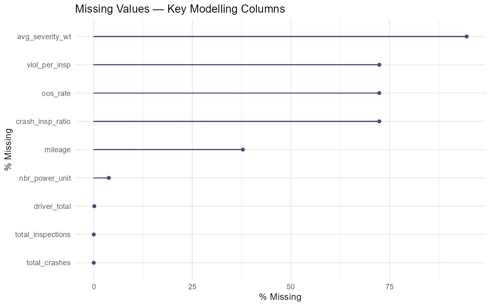
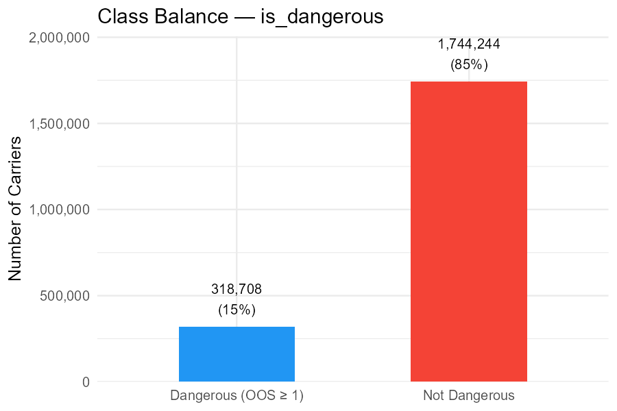
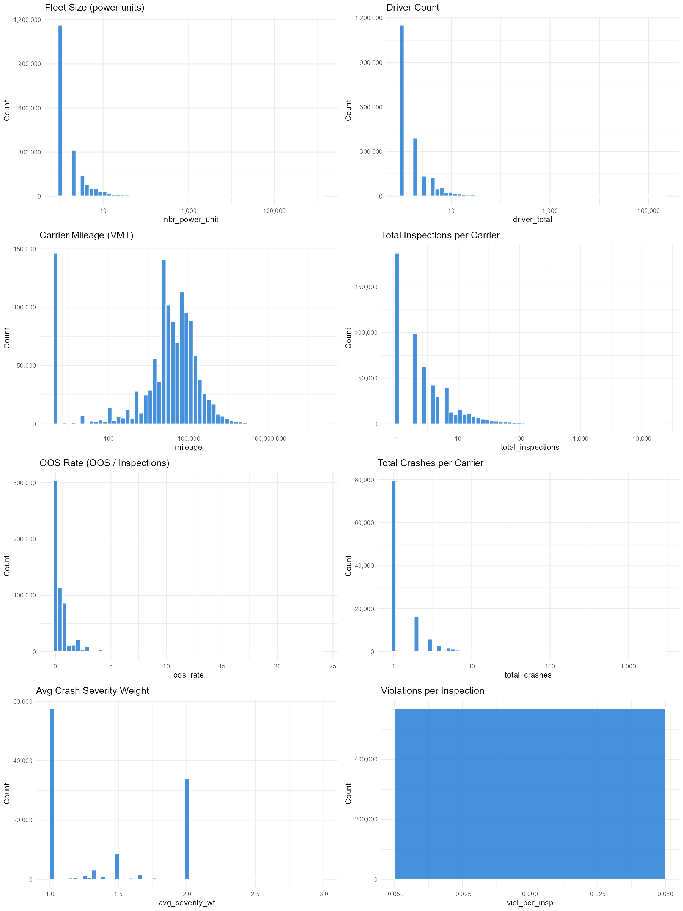
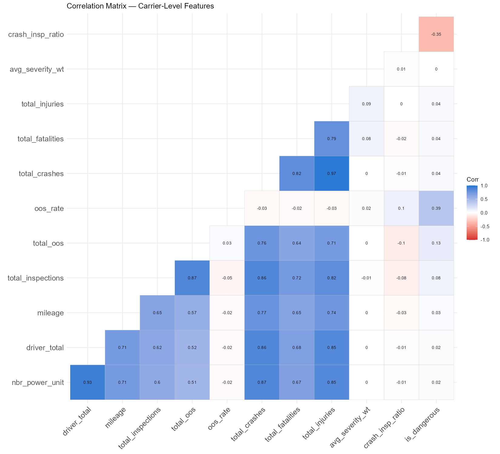
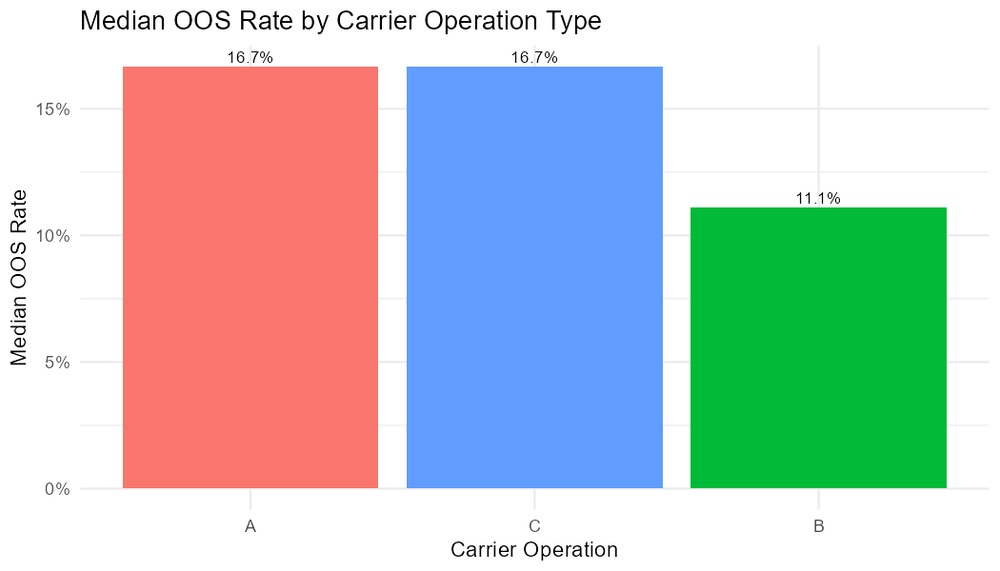
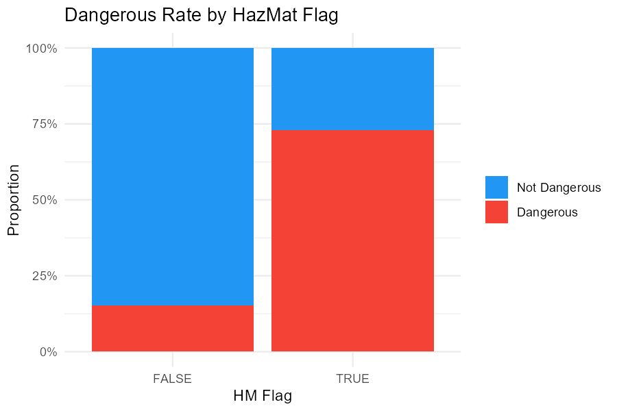

### Q1 — Random Forest: Predicting OOS Violations
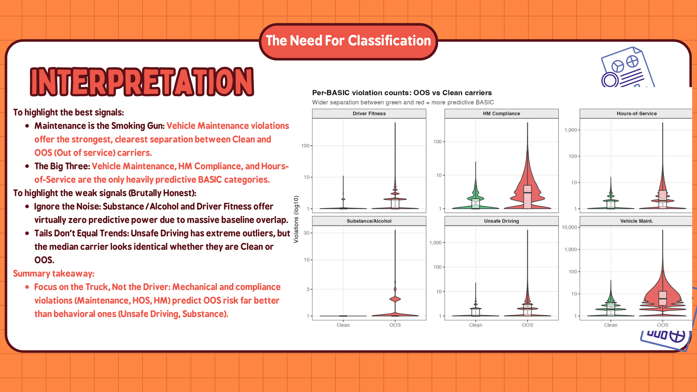
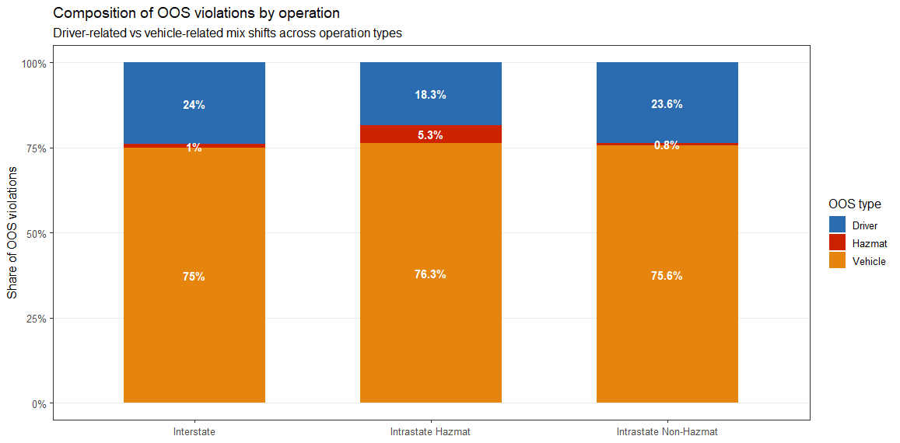
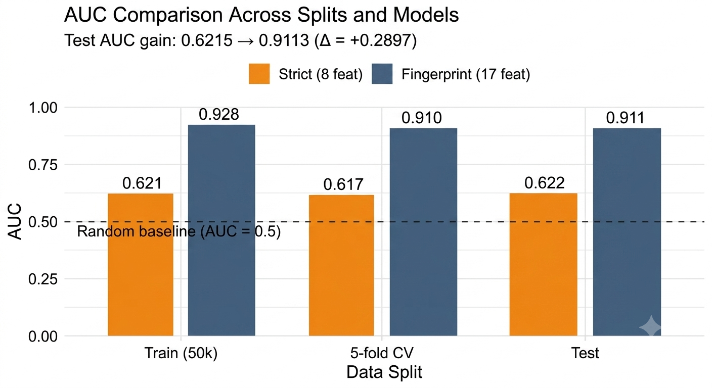
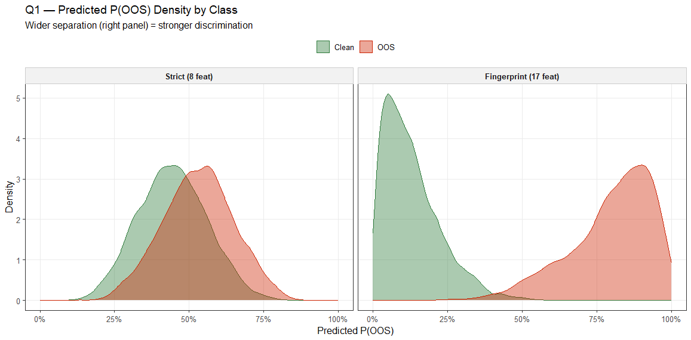
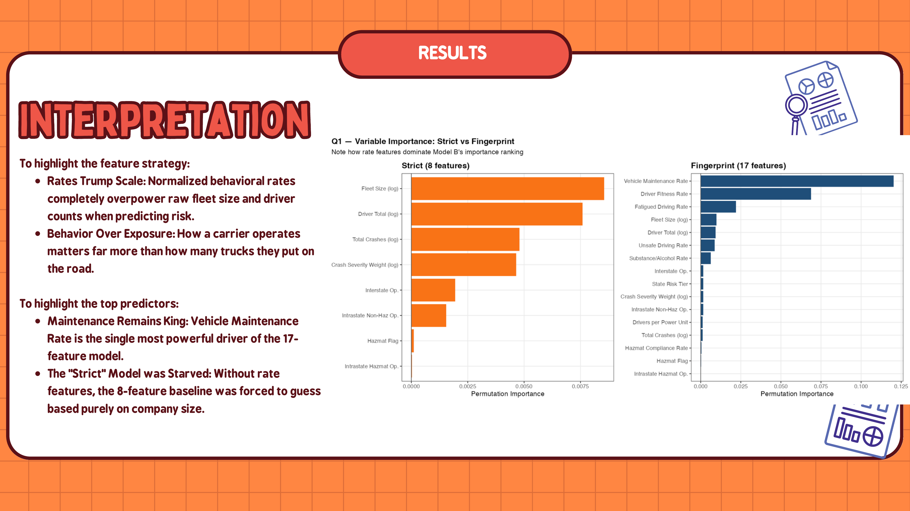

### Q2 — K-Means Risk Segmentation
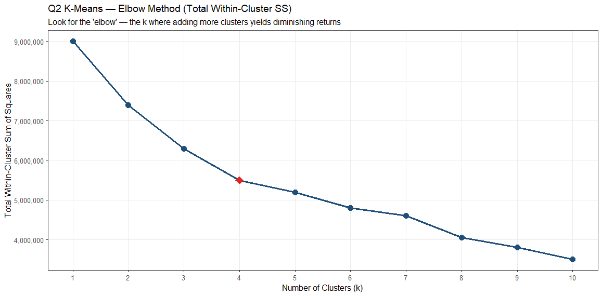
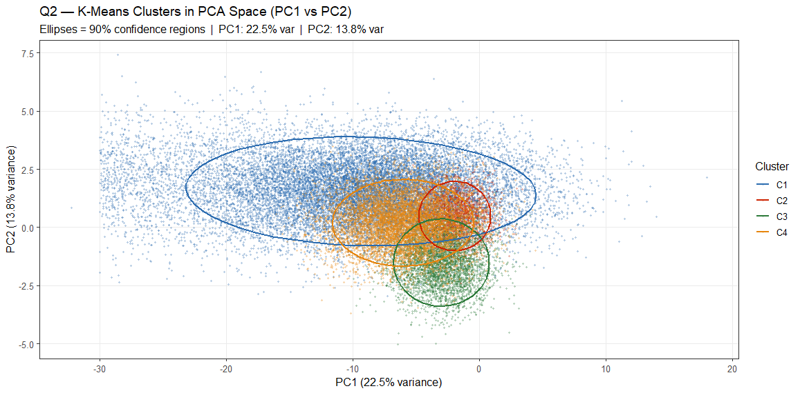
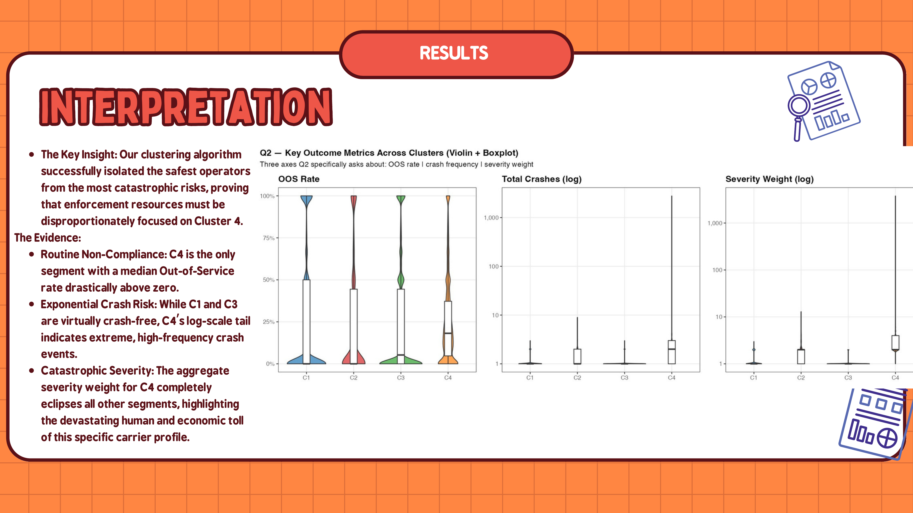
